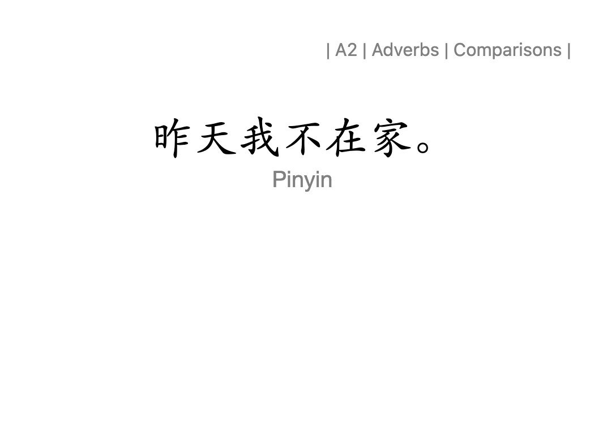
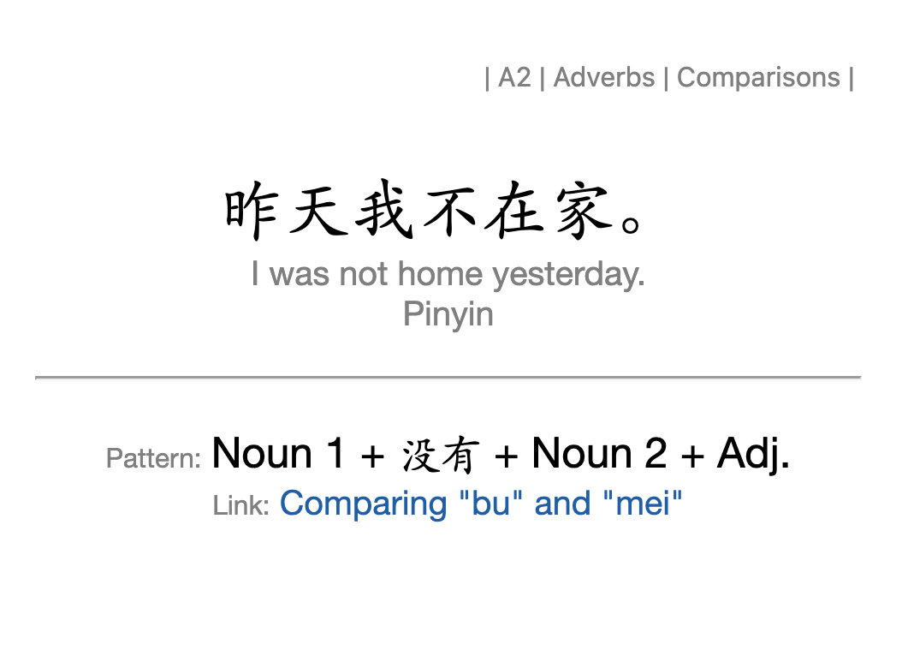
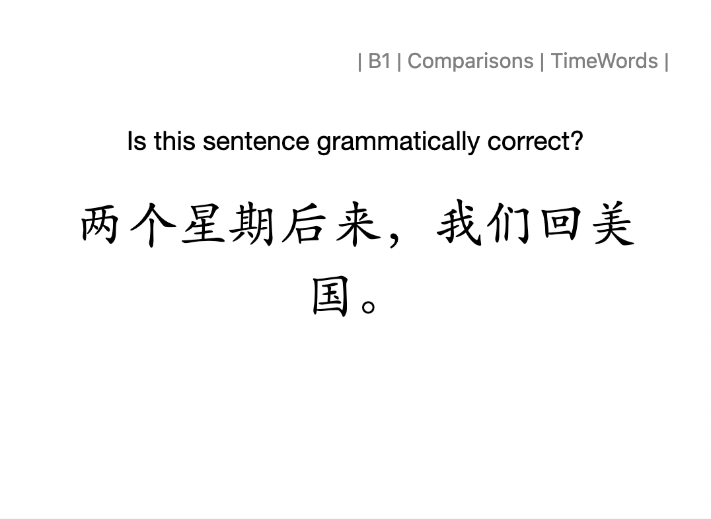
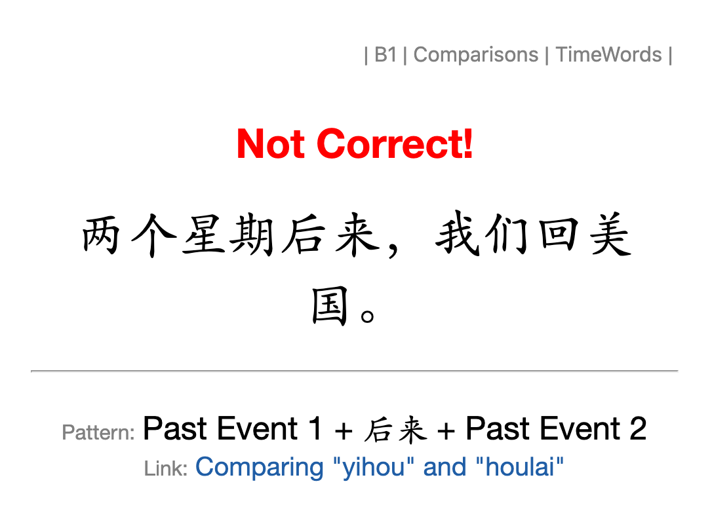

# Chinese Grammar Wiki Cards

These cards were modified from this [deck](https://ankiweb.net/shared/info/782551504) and link to AllSet Learning's [Chinese Grammar Wiki](https://resources.allsetlearning.com/chinese/grammar/Main_Page)

# Card 1 Translation
This Card will only generate if the `Example Type` Field is not filled.

## Front



```html
{{^Example Type}}
<div class=tags>{{Tags}}</div> 
<div class="front">
  <div class="hanzi">{{中文}}</div>
  <div class="pinyin">{{hint::Pinyin}}</div>
</div>

<script>
  // Split hierarchical tags
  var tagsContainerEl = document.querySelectorAll('.tags > *')
  if (tagsContainerEl.length > 0) {
    var tags = []
    tagsContainerEl.forEach((tagEl) => {
      tagEl.classList.add('prettify-tag')
      tags.push(tagEl.innerHTML)
      tags.forEach((tag) => {
        var childTag = tag.split('::').filter(Boolean)
        tagEl.innerHTML = childTag[childTag.length - 1].trim()
      })
    })
  } else {
    tagsContainerEl = document.querySelector('.tags')
    var tags = tagsContainerEl.innerHTML.split(' ').filter(Boolean)
    var html = '|&nbsp;'
    tags.forEach((tag) => {
      var childTag = tag.split('::').filter(Boolean)
      html +=
        "<span class='prettify-tag'>" +
        childTag[childTag.length - 1] + '&nbsp;|&nbsp;'
        '</span>'
    })
    tagsContainerEl.innerHTML = html
  }
</script>
{{/Example Type}}
```

## Back



```html
{{#Tags}}<div class="tags">{{Tags}}</div>{{/Tags}}
<div class="front">
  <div class="hanzi">{{中文}}</div>
  {{#English}}<div class="english">{{English}}</div>{{/English}}
  {{#Pinyin}}<div class="pinyin">{{hint::Pinyin}}</div>{{/Pinyin}}
</div>

<hr id=answer>

<div class="lessonInfo">
  {{#Notes}}<div class="notes">{{Notes}}</div>{{/Notes}}
  {{#Grammar Construct}}
    <div class="pattern">{{Grammar Construct}}</span></div>
  {{/Grammar Construct}}
  {{#Source URL}}
    <div class="article"><a href={{Source URL}}>{{Article Title}}</a></div>
  {{/Source URL}}
</div>

<script>
  // Split hierarchical tags
  var tagsContainerEl = document.querySelectorAll('.tags > *')
  if (tagsContainerEl.length > 0) {
    var tags = []
    tagsContainerEl.forEach((tagEl) => {
      tagEl.classList.add('prettify-tag')
      tags.push(tagEl.innerHTML)
      tags.forEach((tag) => {
        var childTag = tag.split('::').filter(Boolean)
        tagEl.innerHTML = childTag[childTag.length - 1].trim()
      })
    })
  } else {
    tagsContainerEl = document.querySelector('.tags')
    var tags = tagsContainerEl.innerHTML.split(' ').filter(Boolean)
    var html = '|&nbsp;'
    tags.forEach((tag) => {
      var childTag = tag.split('::').filter(Boolean)
      html +=
        "<span class='prettify-tag'>" +
        childTag[childTag.length - 1] + '&nbsp;|&nbsp;'
        '</span>'
    })
    tagsContainerEl.innerHTML = html
  }
</script>
```

# Card 2 - Is Valid

This Card will only generate if the `Example Type` Field is filled.

## Front 



```html
{{#Example Type}}
  {{#Tags}}<div class="tags">{{Tags}}</div>{{/Tags}}
  <div class="front">
    <div class="header">Is this sentence grammatically correct?</div>
    <div class="hanzi">{{中文}}</div>
  {{#Pinyin}}<div class="pinyin">{{hint::Pinyin}}</div>{{/Pinyin}}</div>
</div>

<script>
  // Split hierarchical tags
  var tagsContainerEl = document.querySelectorAll('.tags > *')
  if (tagsContainerEl.length > 0) {
    var tags = []
    tagsContainerEl.forEach((tagEl) => {
      tagEl.classList.add('prettify-tag')
      tags.push(tagEl.innerHTML)
      tags.forEach((tag) => {
        var childTag = tag.split('::').filter(Boolean)
        tagEl.innerHTML = childTag[childTag.length - 1].trim()
      })
    })
  } else {
    tagsContainerEl = document.querySelector('.tags')
    var tags = tagsContainerEl.innerHTML.split(' ').filter(Boolean)
    var html = '|&nbsp;'
    tags.forEach((tag) => {
      var childTag = tag.split('::').filter(Boolean)
      html +=
        "<span class='prettify-tag'>" +
        childTag[childTag.length - 1] + '&nbsp;|&nbsp;'
        '</span>'
    })
    tagsContainerEl.innerHTML = html
  }
</script>
{{/Example Type}}
```

## Back



```html
{{#Tags}}<div class="tags">{{Tags}}</div>{{/Tags}}
<div class="front">
  {{#Example Type}}<div class="{{Example Type}}"></div>{{/Example Type}}
  <div class="hanzi">{{中文}}</div>
  {{#English}}<div class="english">{{English}}</div>{{/English}}
  {{#Pinyin}}<div class="pinyin">{{hint::Pinyin}}</div>{{/Pinyin}}
</div>

<hr id=answer>

<div class="lessonInfo">
  {{#Notes}}<div class="notes">{{Notes}}</div>{{/Notes}}
  {{#Grammar Construct}}
    <div class="pattern">{{Grammar Construct}}</span></div>
  {{/Grammar Construct}}
  {{#Source URL}}
    <div class="article"><a href={{Source URL}}>{{Article Title}}</a></div>
  {{/Source URL}}
</div>

<script>
  // Split hierarchical tags
  var tagsContainerEl = document.querySelectorAll('.tags > *')
  if (tagsContainerEl.length > 0) {
    var tags = []
    tagsContainerEl.forEach((tagEl) => {
      tagEl.classList.add('prettify-tag')
      tags.push(tagEl.innerHTML)
      tags.forEach((tag) => {
        var childTag = tag.split('::').filter(Boolean)
        tagEl.innerHTML = childTag[childTag.length - 1].trim()
      })
    })
  } else {
    tagsContainerEl = document.querySelector('.tags')
    var tags = tagsContainerEl.innerHTML.split(' ').filter(Boolean)
    var html = '|&nbsp;'
    tags.forEach((tag) => {
      var childTag = tag.split('::').filter(Boolean)
      html +=
        "<span class='prettify-tag'>" +
        childTag[childTag.length - 1] + '&nbsp;|&nbsp;'
        '</span>'
    })
    tagsContainerEl.innerHTML = html
  }
</script>
```

# Card Styling
## Chinese Grammar

View:
 - [Core Card CSS](../Core-Templates/core-card.css)
 - [Chinese Grammar Wiki Card](Chinese-Grammar-Wiki.css)

```css
@import url("core-card.css");
:root {
	--font-cn-pc: "Kaiti SC", KaiTi, "Noto Serif SC", "MS Mincho", "ＭＳ 明朝", serif;
	--font-cn-mob:"Noto Serif SC", "Noto Serif Simp", HYQIHei, serif;
}
/* Universal Styling */
.card {
	font-family: var(--font-sans-serif), var(--font-cn-pc), var(--font-ui);
	font-size: var(--fs-base);
	font-variant-east-asian: simplified;
	text-align: center;
	color: black;
	background-color: white;
}
.mobile .card {font-family: var(--font-sans-serif), var(--font-cn-mob);}
.hint {color: gray}
a {color:#205EA6;}

/* Spacing */
.front {margin-top:20px;}
.front > div + div,
.lessonInfo > div + div {margin-top:10px 0;}

hr#answer{margin:1.5rem 0;}

/* FRONT */
/* Chinese Fonts*/
.hanzi {
	font-family: var(--font-cn-pc);
  font-size: var(--fs-xl);
}
ruby rt {
	visibility: hidden;
	font-variant-east-asian: ruby;
}
ruby:hover rt {visibility: visible;}

.pinyin, .english {color: gray;}

/* ONLY for IS Valid Card Types */
.header {margin-bottom: 20px;}

.invalid, .valid {
	font-size: var(--fs-lg);
	font-weight: bold;
	margin-bottom: 20px;
}

.valid::after {
	content: "Correct!";
	color: green;
}

.invalid::before {
	content: "Not Correct!";
	color: red;
}

/* BACK -- lessonInfo div */
.notes {font-size: var(--fs-md);}
.pattern {font-size: var(--fs-md);}
.article {font-size: var(--fs-base);}

.article::before, .pattern::before {
	font-size:var(--fs-sm);
	color: grey;
	margin-right: 5px;
}
.pattern::before{content: "Pattern:";}
.article::before{content: "Link:";}
```
