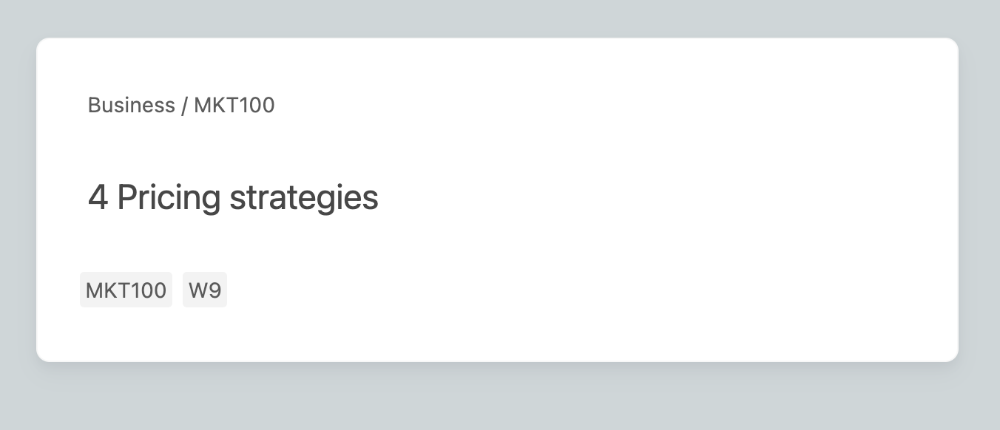
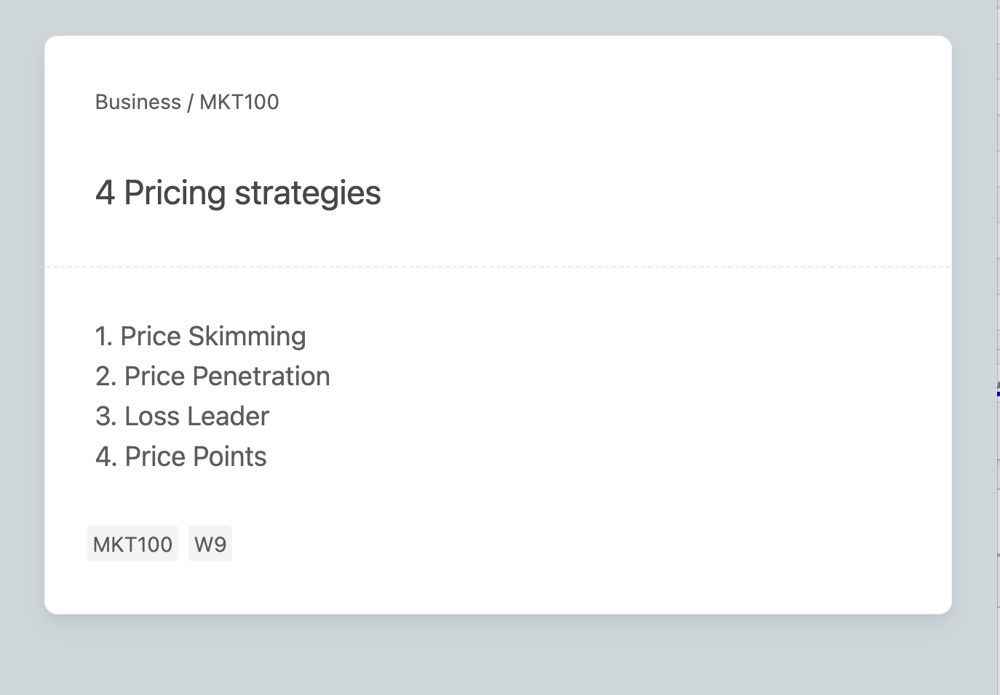

# Anki Templates

This is my small collection of Anki Templates and links to any other helpful resources I have found.

I apply the **[Core Card Styling](/General%20Styles/_core-card.css)** to all cards to add uniformity and declare standardized responsive fonts sizes.

[Flexoki Theme](/General%20Styles/_flexoki-theme.css) was adapted from [kepano/flexoki](https://github.com/kepano/flexoki.git) and includes the extended theme.

# Templates

## [Minimal Style](Templates/Minimal/README.md)

Two card Types, Basic (and Reversed) and Cloze.

### Front

### Back

## [Chinese Vocab](/Templates/Chinese%20Vocab/README.md)

There are 3 different cards types: `Test Pinyin`, `Test Hanzi`, `Test Meaning`.

### Test Hanzi Front

### Test Hanzi Front

## [Chinese Grammar Wiki](Templates/Chinese%20Grammar%20Wiki/README.md)

 Cards can either ask for a translation or if the sentence is grammatically correct.
### Front

### Back

# Add-ons Used

## Editing

|Anki Page|Anki Code|Repo|
|---|---|---|
|[Advanced Browser](https://ankiweb.net/shared/info/874215009)|`874215009`|[AnKing-VIP/advanced-browser](https://github.com/AnKing-VIP/advanced-browser)|
|[AnkiWebView Inspector](https://ankiweb.net/shared/info/31746032)|`31746032`|[hikaru-y/anki21-addon-ankiwebview-inspector](https://github.com/hikaru-y/anki21-addon-ankiwebview-inspector)|
|[Batch Editing](https://ankiweb.net/shared/info/291119185)|`291119185`|[glutanimate/batch-editing](https://github.com/glutanimate/batch-editing)|

## Language

|Name|Anki Code|Repo|
|---|---|---|
|[Chinese Support 3](https://ankiweb.net/shared/info/1752008591)|`1752008591`|[Gustaf-C/anki-chinese-support-3](https://github.com/Gustaf-C/anki-chinese-support-3)|
|[Hanzi Stats](https://ankiweb.net/shared/info/181243826)|`181243826`|[trevorld/Hanzi_Stats](https://github.com/trevorld/Hanzi_Stats)|

## Misc

|Name|Anki Code|Repo|
|---|---|---|
|[Exam Notifier](https://ankiweb.net/shared/info/236593452)|`236593452`|[AnKing-VIP/exam-notifier](https://github.com/AnKing-VIP/exam-notifier)|
|[FSRS4Anki Helper](https://ankiweb.net/shared/info/759844606)|`759844606`|[open-spaced-repetition/fsrs4anki-helper](https://github.com/open-spaced-repetition/fsrs4anki-helper)|
|[Review Heatmap](https://ankiweb.net/shared/info/1771074083)|`1771074083`|[glutanimate/review-heatmap](https://github.com/glutanimate/review-heatmap)|
