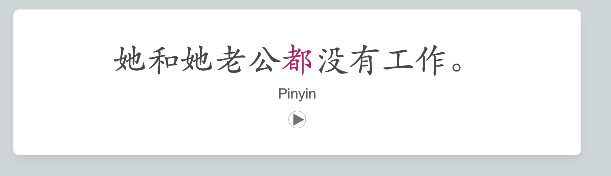
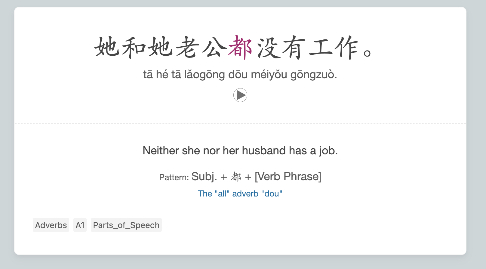
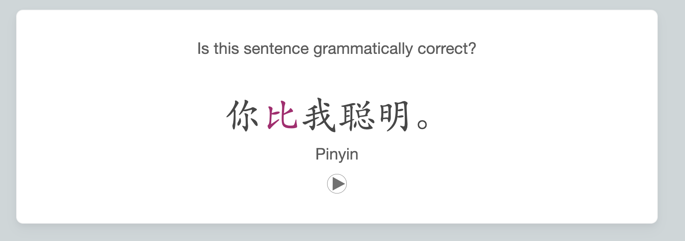
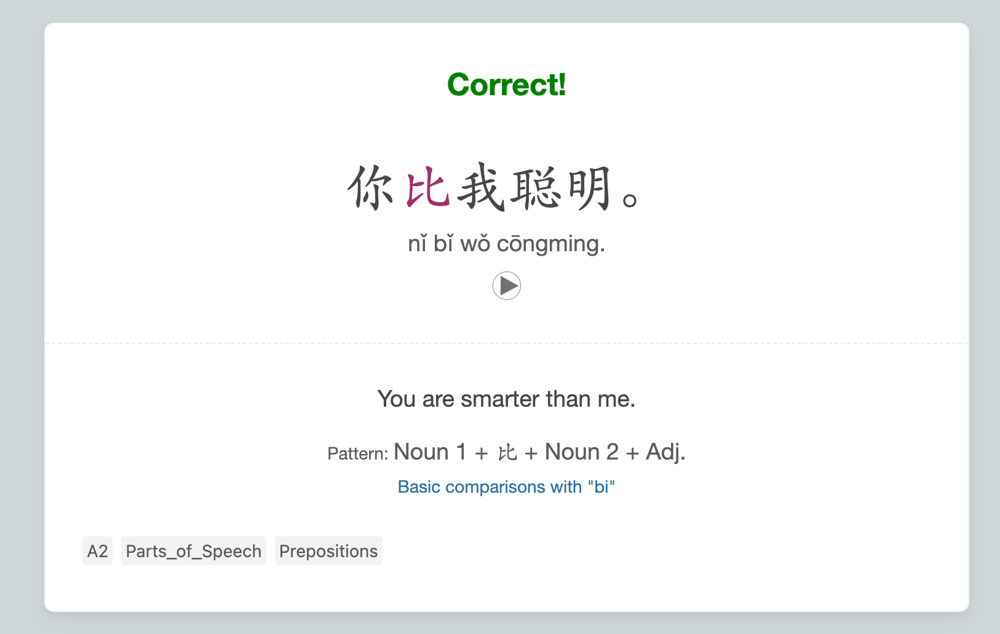

# Chinese Grammar Wiki Cards

These cards were modified from this [shared deck](https://ankiweb.net/shared/info/782551504) and link to AllSet Learning's [Chinese Grammar Wiki](https://resources.allsetlearning.com/chinese/grammar/Main_Page). There is only one note type with two cards.

All styling should be called as `@import url('Chinese-Grammar-Wiki.css');` from the card styling options and should be stored in the media folder. It will also internally call the [Core Card CSS](/General%20Styles/_core-card.css) to set basic styling settings, font sizes, and families and it will also need to be downloaded.

Download the modified deck [here](ChineseGrammarWiki.apkg) and the original deck can be found on the Anki [website](https://ankiweb.net/shared/info/782551504).

## Card 1 Translation

This Card will only generate if the `Example Type` Field is `empty`.

|Front| Back|
|:---:|:---:|
|||

## Card 2 - Is Valid

This Card will only generate if the `Example Type` Field is filled with `valid` or `invalid`. Anything inside the field will not be shown.

|Front| Back|
|:---:|:---:|
|||
