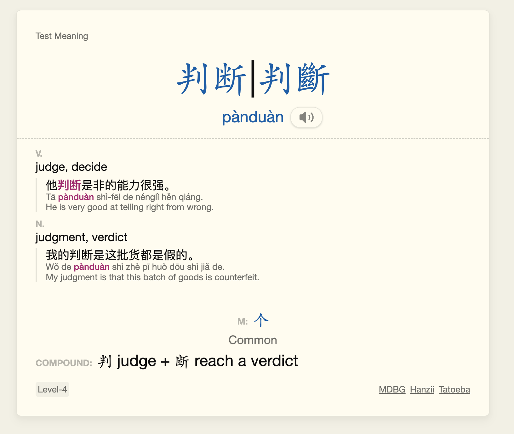

# Mandarin Vocab Cards

Cards are created with the help of [Gustaf-C/anki-chinese-support-3](https://github.com/Gustaf-C/anki-chinese-support-3) and imported data from [Pleco](https://www.pleco.com/)

## Card Styling

All styling should be called as `@import url('Chinese-Vocab.min.css');` from the card styling options and should be stored in the media folder. It will also internally call the [Core Card CSS](/General%20Styles/core-card.css) and [Flexoki Theme CSS](/General%20Styles/flexoki-theme.css) to set basic styling settings, font sizes and families and it will also need to be downloaded.

## Note Types

### Test Pinyin

#### Front

<figure>
  
  <figcaption>The english meaning can be clicked as a hint</figcaption>
</figure>
<figure>
  
  <figcaption>The front of the hard with hint and example revealed if it is included.</figcaption>
</figure>

#### Back

<figure>
  |
  <figcaption></figcaption>
</figure>

### Test Hanzi

#### Front

<figure>
  
  <figcaption>Type in the hanzi (in simplified). Click the audio button to hear the word or "# of Chars" for another hint.</figcaption>
</figure>
<figure>
  
  <figcaption>The number of characters is revealed. Click again for the pinyin.</figcaption>
</figure>
<figure>
  
  <figcaption>The pinyin is revealed.</figcaption>
</figure>

#### Back

<figure>
  |
  <figcaption>If the characters are correct it will display a checkmark. Otherwise correct characters will have a green background and incorrect will have a red background.</figcaption>
</figure>

### Test Meaning

#### Front

#### Back

