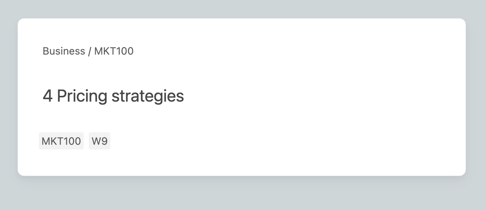
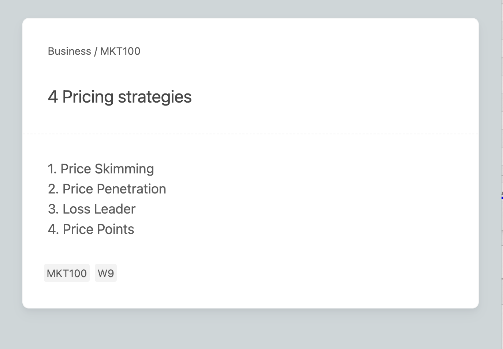
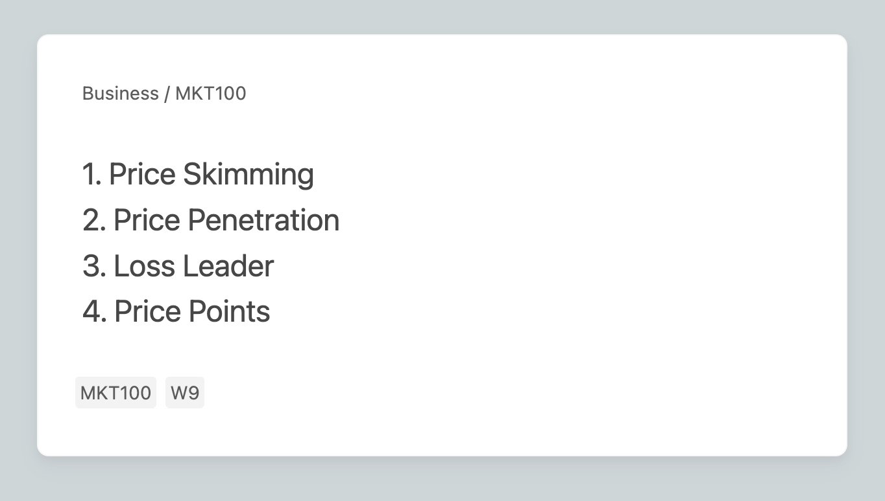
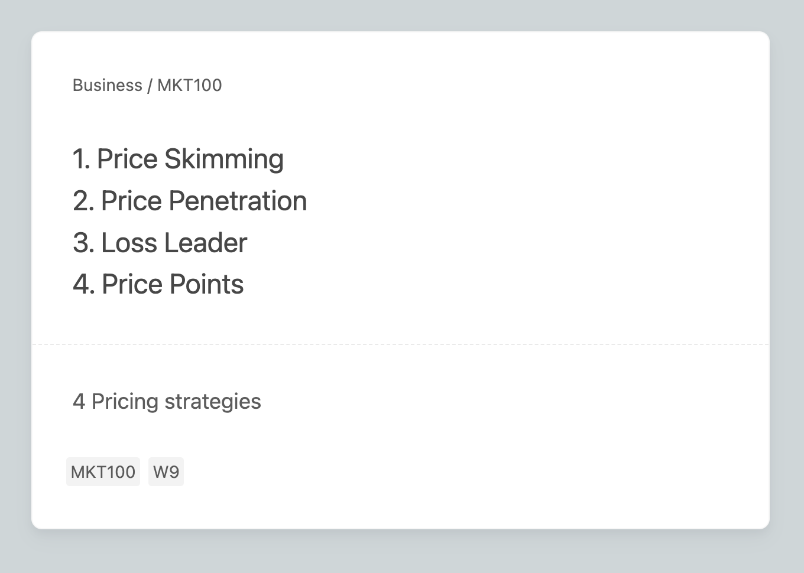
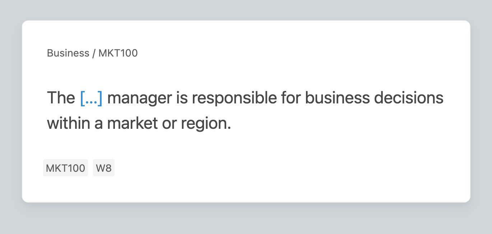
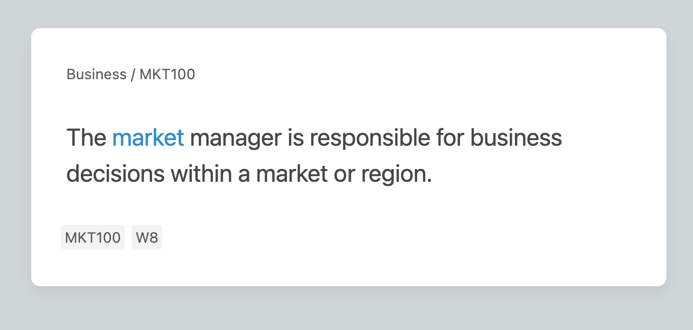
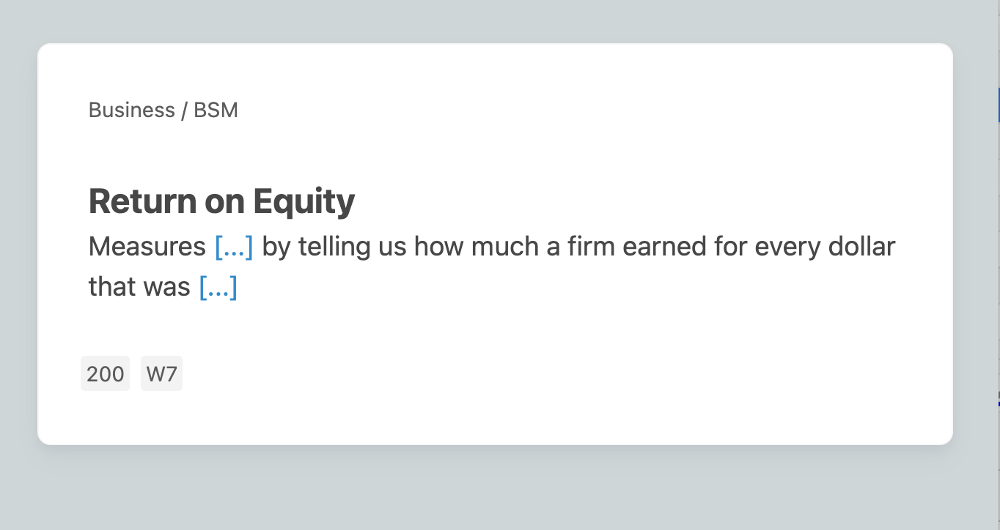
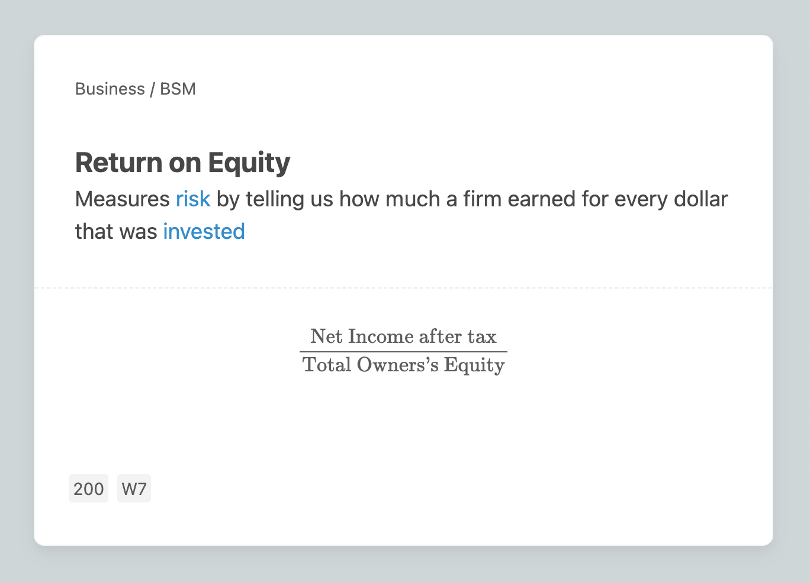

# Minimal Style Notes

The [Minimal](minimal.css) template was adapted from [pranavdeshai/anki-prettify/themes/minimal](https://github.com/pranavdeshai/anki-prettify/tree/9d1a9cad9c047e3be4f804fc1958c93b132977ae/themes/minimal). There are two notes types, Basic with a *optional* reversal and a Cloze Note. Both card types use the same file and changes to it will effect both cards. Major changes include fluid typography settings and allowing iPads to have same margins as desktops. All styling should be called as `@import url('minimal.css');` from the card styling options and should be stored in the media folder.

## Note Types

### Minimal Basic Reverse
Field Types are:
1. `Front`
2. `Back`
3. `Example`
4. `Add Reverse` (for more info see [notes](#reversed-optional))

#### Basic Card

This card will always be generated.

|Front| Back|
|:---:|:---:|
|||

#### Reversed (Optional)

This card will only generate if the `Add Reverse` field is `not empty`. This allows to you create optional reverse cards from a single deck type. Text in this field will **not** be shown and anything can be entered to generate a reversal.

You will need to add this field to the default Minimal Basic Note Type which can be downloaded [here](https://github.com/pranavdeshai/anki-prettify/blob/9d1a9cad9c047e3be4f804fc1958c93b132977ae/themes/minimal/notetypes/prettify-minimal-basic.apkg).

|Front| Back|
|:---:|:---:|
|||

### Minimal Cloze

There is only one card type but cloze cards can generate multiple cards based the number of cloze deletions.

There are only 3 fields:
1. `Text`
2. `Back Extra`
3. `Example`

|Front| Back|
|:---:|:---:|
|||

#### Definition
For cards that may have a term and definition the both can be entered into the `Text` field and should be wrapped as a `div` like the example below.

```html
<div class="term">Return on {{c2::Equity}}</div>
<div class="def">Measures {{c1::risk}} by telling us how much a firm earned for every dollar that was {{c1::invested}}</div>
```

The term will show as bolded text where the definition will smaller text. See examples below.

|Front| Back|
|:---:|:---:|
|||
